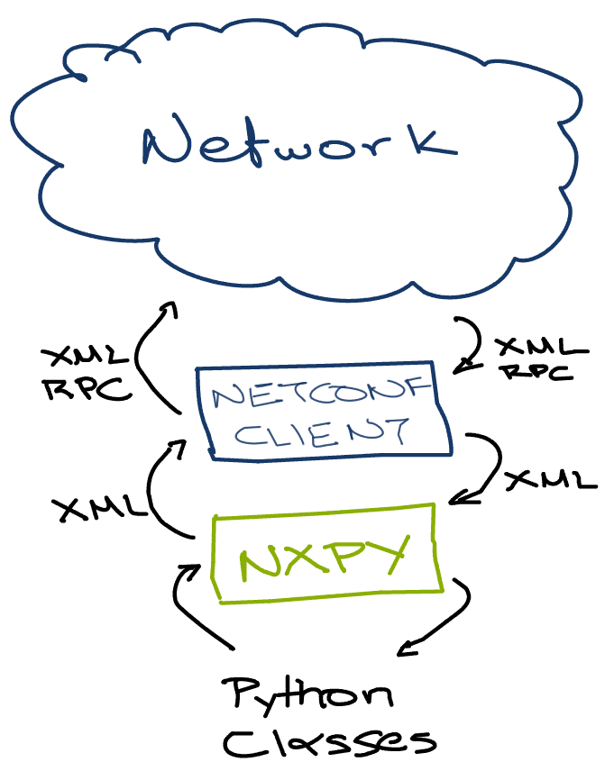

# nxpy: Network XML Python Proxy

`nxpy` maps exported XML configuration (from Juniper network devices) to python
classes. It is compatible only with Junipers' xml configuration and is developed
to work alongside [ncclient](https://github.com/ncclient/ncclient).

## Description

nxpy allows for retrieving the device configuration in xml format (using either
netconf or "show configuration | display xml" via an expect script), transform
the configuration to python classes in order to manipulate them (view, edit,
delete).  After editing, the configuration can be applied back to the device via
netconf or cli expect.

Furthermore, it allows for building configuration via python classes, and apply
it to the device(s) via netconf or cli expect.  For the time, it supports
limited configuration changes.




## Installing

As of v0.4.2, nxpy is available on Pypi, so you can install with pip:

```
pip install juniper-nxpy
```

Or you can install manually. After cloning the project run:

```
python setup.py install
```

Requirements:

* Python 2.6 <= version < 3.0
* lxml (tested with 2.2.6)

## Supported Configuration Mappings

* Configuration
  * Interfaces
  * Vlans
* Interface
  * Name
  * Description
  * Unit(s)
* Vlan
  * Name
  * Vlan Id
* Unit
  * Name
  * Description
  * Vlan Id
  * Family
    * Name
    * Addresses
      * Address
      * Name
    * MTU
    * Vlan Members

## Examples

### Parse configuration from device

* Grab the configuration in xml format

XML configuration can be retrieved from devices that support export to XML:

* via netconf
* via cli
* via cli expect scripts.

You can use also run "show configuration | display xml" (and
copy paste the output to a file), or use an automated cli excpect script or
invoke netconf.

* Feed the configuration to nxpy

```
import nxpy as np
conf = np.Parser(<configuration_file_OR_configuration_text>)
conf = conf.export()
```

To check if it worked:

```
conf.interfaces
```

(...you should get the list of device interfaces)

### Create config

You can also create configuration from scratch:

```
from lxml import etree as ET
import nxpy as np
device = np.Device()
ifce = np.Interface()
ifce.name = 'ge-0/0/0'
ifce.description = 'NEW_DESCRIPTION'
device.interfaces.append(ifce)

device = device.export()
configuration = ET.tostring(device)

print configuration
```

This will return XML formatted device configuration.

## Apply the change with NCCLIENT

You can use ncclient to apply the configuration created in the previous example:

```
# import the ncclient library
from ncclient import manager
# AND replace:
device = device.export()
# with:
device = device.export(netconf_config=True)
# to make configuration netconf-compatible
# Now to pass configuration to device:

with manager.connect(host=<HOSTNAME>, port=830, username=<USERNAME>, password=<PASSWORD>) as m:
    m.edit_config(target='candidate', config=configuration, test_option='test-then-set')
    m.commit(confirmed=True, timeout='120')
    m.commit(confirmed=False)

# the above should change the description of interface ge-0/0/0 to NEW_DESCRIPTION
```

## Changelog

* v0.4.2:
  * Python packaging changes (README,setup.py)
  * Change license to GPLv3
  * Preliminary support for L2VPNS
  * Ethernet OAM support
* v0.4.1:
  * Fix version in setup.py
* v0.4:
  * Added full support for bgp flowspec (routing-options flow) configuration
* v0.3:
  * Support for basic interface configuration (name, description, vlan)
  * Support for basic vlan configuration

## License

This project is licensed under the GPL License - see the [LICENSE](LICENSE) file
for details.
